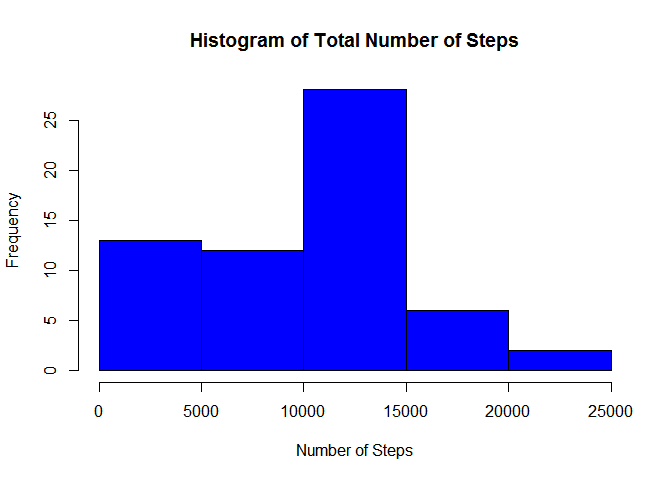
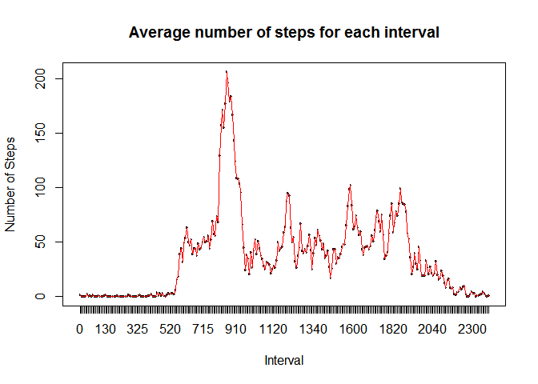
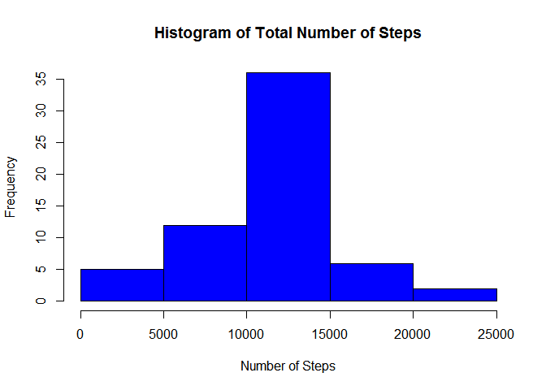
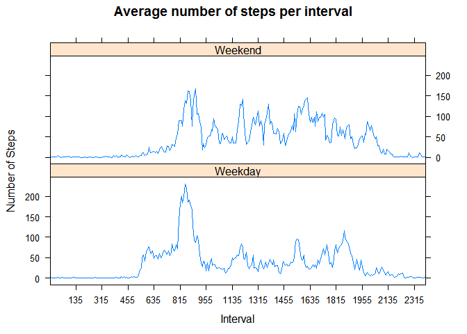

# Reproducible Research: Peer Assessment 1


## Loading and preprocessing the data


```r
  library(RCurl)
```

```
## Warning: package 'RCurl' was built under R version 3.1.2
```

```
## Loading required package: bitops
```

```r
  library(lattice)

  activity <- read.csv("activity.csv")
```


## What is mean total number of steps taken per day?


```r
  activitySum <- aggregate(x = activity[c("steps")], by = list(activity$date), FUN=sum, na.rm = TRUE)
  activitySum$Date <- factor(activitySum$Group.1)
  DailyMean <- mean(activitySum$steps)
  DailyMedian <- median(activitySum$steps)
```

The daily total mean number of steps is 9354.2295082.  
The daily total median number of steps is 10395  


```r
hist(activitySum$steps, col="blue", xlab="Number of Steps", main="Histogram of Total Number of Steps")
```

 


## What is the average daily activity pattern?


```r
  activityInterval <- aggregate(x = activity[c("steps")], by = list(activity$interval), FUN=mean, na.rm = TRUE)
  activityInterval$Interval <- factor(activityInterval$Group.1)
  ActivityMax <- activityInterval[which.max(activityInterval$steps),]
  ActivityMaxInterval <- ActivityMax$Interval
```

The interval with the most number of steps in a day is 835


```r
  plot(activityInterval$Interval, activityInterval$steps, type = "l", xlab = "Interval", ylab = "Number of Steps", main = "Average number of steps for each interval")
  lines(activityInterval$Interval, activityInterval$steps, col = "red")
```

 

## Imputing missing values


```r
  AMeanMerge <- merge(activity, activityInterval, by.x="interval", by.y="Interval")
  MissingV <- is.na(AMeanMerge$steps.x)
  NumberMissing <- nrow(AMeanMerge[MissingV,])
  AMeanMerge[MissingV,]$steps.x <- AMeanMerge[MissingV,]$steps.y
  NewActivitySum <- aggregate(x = AMeanMerge[c("steps.x")], by = list(AMeanMerge$date), FUN=sum)
  NewActivitySum$Date <- factor(NewActivitySum$Group.1)
  NewDailyMean <- mean(NewActivitySum$steps.x)
  NewDailyMean <- format(NewDailyMean, scientific = FALSE)
  NewDailyMedian <- median(NewActivitySum$steps.x)
  NewDailyMedian <- format(NewDailyMedian, scientific = FALSE)
```

The number of missing step values is 2304   
The daily total mean number of steps is 10766.19.  Missing values assigned interval averages.     
The daily total median number of steps is 10766.19  Missing values assigned interval averages.  

Data missing from the number of steps was replaced with the average value of the number of steps for that interval calculated from a sub set of the dataset with no missing values.  The effect of modifing the original dataset in this manner was to increase the mean approximately 15 percent of the original value and increase the median approximately 4 percent.


```r
hist(NewActivitySum$steps.x, col="blue", xlab="Number of Steps", main="Histogram of Total Number of Steps")
```

 

## Are there differences in activity patterns between weekdays and weekends?


```r
  AMeanMerge$Day <- (weekdays(as.Date(AMeanMerge$date, format='%Y-%m-%d')))
  AMeanMerge$DayDesc <- "Weekday"
  AMeanMerge[AMeanMerge$Day == "Saturday" | AMeanMerge$Day == "Sunday", ]$DayDesc <- "Weekend"


  AMeanMergeInterval <- aggregate(x = AMeanMerge[c("steps.x")], by = list(AMeanMerge$interval,      AMeanMerge$DayDesc), FUN=mean)
  AMeanMergeInterval$Interval <- factor(AMeanMergeInterval$Group.1)
  AMeanMergeInterval$DayDesc <- factor(AMeanMergeInterval$Group.2)
```
 

```r
xyplot(steps.x~Interval|DayDesc, data=AMeanMergeInterval, layout = c(1,2), type = "l",
       xlab = "Interval", ylab = "Number of Steps", main = "Average number of steps per interval", scales = list(x = list(at = c(20,40,60,80,100,120,140,160,180,200,220,240,260,280))))
```

 
